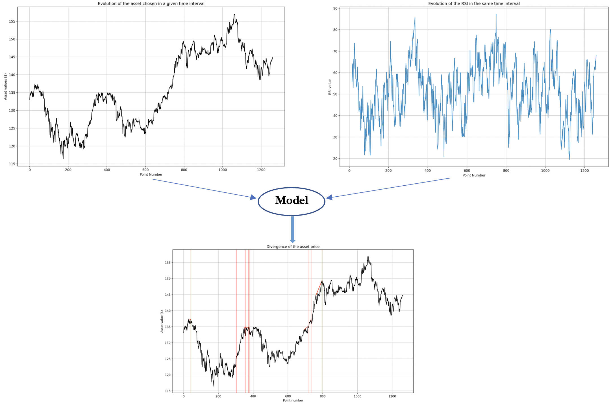
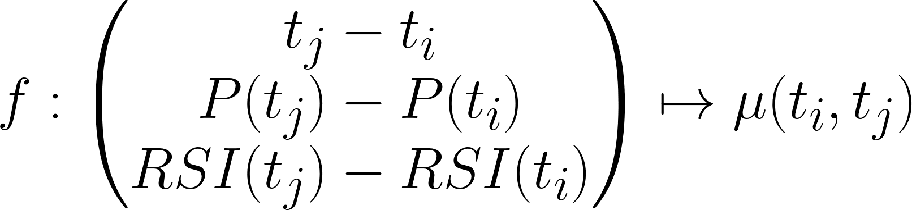

# algorithmic_trading

This project has been realized in coorperation with the student Hugo BESSON. It consists on the automatic detection of divergences, which occur between an asset and a momentum indicator. In the world of technical analysis, such project is relevant as such divergences indicate, with high probability, the direction in which the asset is likely to evolve. 

The present project allows to perform detection of the 4 types of divergences, which are the regular Bullish and Bearish divergences, and the hidden Bullish and Bearish divergences.

This detection occurs provided that the user provides the following inputs :

- The type of asset on which the detection is performed. 
- The time interval and time resolution associated with the test.
- The type of oscillator to be used (here, the RSI).
- The type of divergence to evaluate (among the four possible)

The result of the algorithm will be a list of two dimensionnals vectors, whose components correspond to the begginings and the ends of the divergences signals. 

The next Figure summarizes the process ;

*Inputs and outputs of the algorithm*

The second step of the algorithm, is to establish, for each divergence, a measure associated to the degree of confidence of it. To so do, a ML algorithm for predicting, given the characteristics of the divergence (length, asset price evolution, oscillator value evolution), a prediction of the *quality* of the divergence. 

*Function to bluid for measuring the quality of a divergence (denoted by \mu)*

A detailed and precise formulation of the problem, the principle and the results of the current version of the algorithm are given in the notebook "Divergence_detection.ipynb" located in the Trading_project folder. 

This project has been designed by Victor LETZELTER and Hugo BESSON from scratch.

