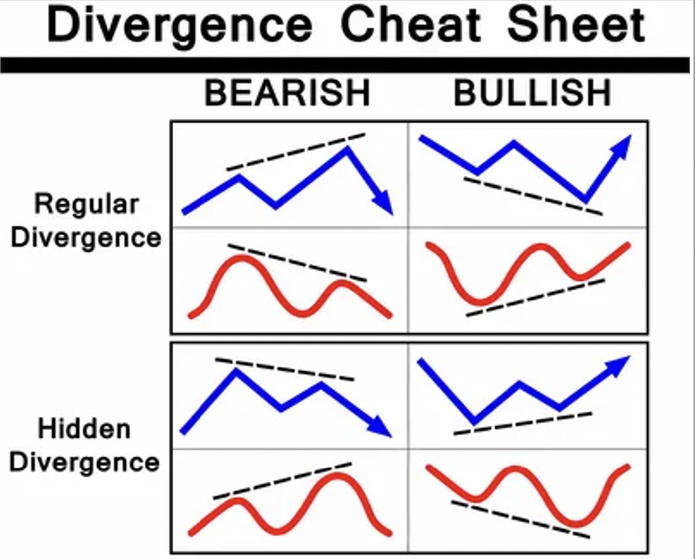

# algorithmic_trading

This project has been realized in coorperation with the student Hugo BESSON. It consists on the automatic detection of divergences, which occur between an asset and an oscillator. In the world of technical analysis, such project is relevant as the divergence asset indicates, with high probability, the direction in which the asset is likely to evolve. 

The present project allows to perform detection of the 4 types of divergences, which are the regular Bullish and Bearish divergences, and the hidden Bullish and Bearish divergences.

*The four types of divergences*

This detection occurs provided that the user gives the following information :

- The type of asset on which the detection is performed. 
- The time interval and time resolution associated with the test.
- The type of oscillator to be used (here, the RSI).

